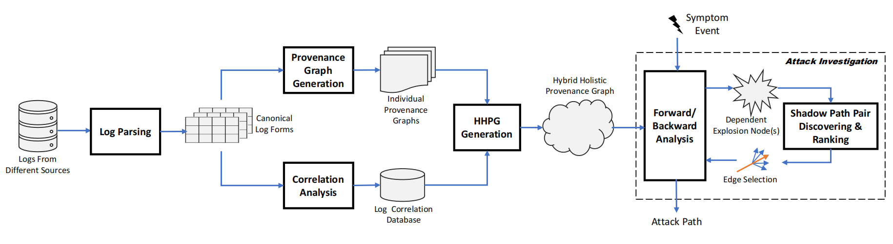

# HHPG

## Work Flow

## Setup Environment

### Prepare database

The project uses SQLite as the database. Make a new directory CLFDB under this project, and the data files generated will be stored in this directory.

### Prepare dataset

Before you start, dataset is needed to be downloaded from [Google Drive](https://drive.google.com/file/d/1n5g-kIsuzBVMSwFg0L0O9kFIKsH9HRqs/view?usp=share_link). Then make a new directory `Logs` under this project, and extract the downloaded dataset to this directory.

### Select dataset

The dataset to be executed is configured as a global variable *Dataset* in `HHPG.go`, where *PostgreSql* is set as default. 

You can also replace this variable with the values listed in the table below to initiate attack investigation workflow on other datasets:

| value of Dataset | Vulnerabilities |
| ---------------- | ----------------------- |
|ATLAS/S1| Strategic Web Compromise |
|ATLAS/S2| Malvertising Dominate |
|ATLAS/S3| Spam Campaign |
|ATLAS/S4| Pony Campaign |
|MiniHttpd| CVE-2018-18778 |
|PostgreSql| CVE-2019-9193 |
|Proftpd| CVE-2019-12815 |
|Nginx| Path Traversal |
|Apache| CVE-2021-41773 |
|Redis| CVE-2022-0543 |
|Vim| CVE-2019-12735 |
|Openssh| CVE-2018-15473 |
|ImageMagick| CVE-2022-44268 |
|php| CVE-2018-20062 |
|APT/S1| Malicious User Insertion |
|APT/S2| Information Theft Attack |

## Start Prov-Navigator

The workflow of Prov-Navigator includes:

1. Transform raw logs into a Canonical Log Form and store it into CLF database
2. Generate provenance graphs
3. Execute a Prov-Navigator attack investigation algorithm.

### Transform logs into CLF

- Execute the command `go ./parser` to parse the raw logs from different sources into canonical forms.
- Then, raw logs will be parsed into the Canonical Log Form and then stored in the database.

### Generate provenance graphs

- Execute the command `go ./Graphbuilder` to generate separate provenance graphs and correlated log graphs from CLF results. 
- Then, individual provenance graphs will be merged into one Hybrid Holistic Provenance Graph (HHPG).

### Start attack investigation

- Execute the command `go ./GraphSearch` to start the attack investigation. 
- The attack subgraph will be generated under the `./Graphs` folder.
